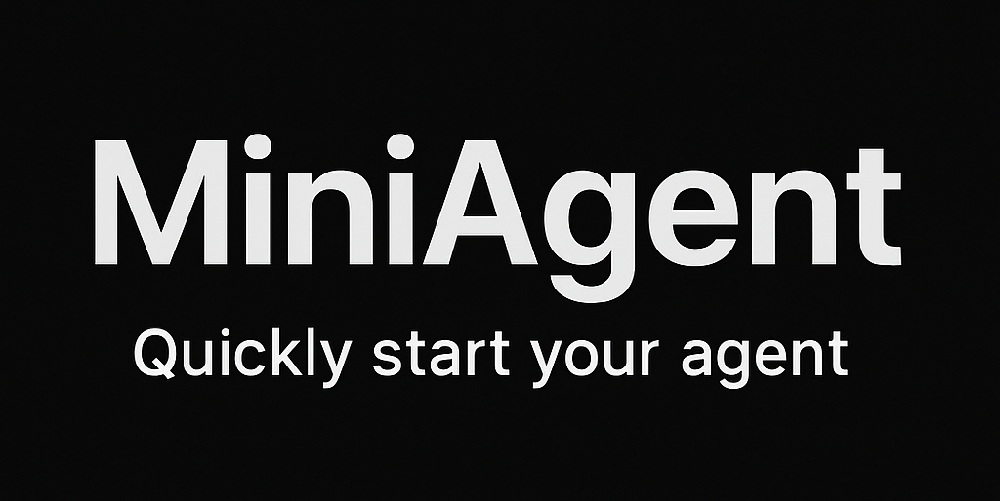

# MiniAgent

- 🚀「Build Your First LLM Agent in 5 Minutes!」 |⚡️[中文版本](README.md)

<div align="center">
  
</div>

## Why Choose MiniAgent?

Help beginners quickly understand Agent principles and implement an Agent. Gain intuitive insights into the details of LLM interaction with tools without complex frameworks, tedious configurations, or steep learning curves.

If you find this project helpful, please give us a ⭐️! Your support drives us to keep improving.

## Features

MiniAgent is a lightweight and easy-to-use LLM Agent framework. Here's why you should choose MiniAgent:

- **Rapid Learning**: Quickly learn how LLM agents work and understand the details of LLM interaction with tools
- **Model Agnostic**: Works with any LLM, even without native function calling capability, compatible with OpenAI, DeepSeek, Anthropic, and other LLMs
- **Minimalist Design**: Clean, readable code focused on core functionality
- **Lightweight**: No heavy dependencies, easy to integrate and extend
- **Simple Tool Integration**: Easy tool registration and invocation through natural language

## Quick Start

### Requirements

- Python 3.8+
- A valid API key for any LLM (OpenAI, DeepSeek, etc.)

### Installation

```bash
# Clone repository
git clone https://github.com/yourusername/MiniAgent.git
cd MiniAgent

# Install dependencies
pip install -r requirements.txt
```

### Configuration

Create a `.env` file in the project root from the `.env.example` file:

```bash
# API Keys
LLM_API_KEY=your_api_key_here

# Model Configuration
LLM_MODEL=deepseek-chat
LLM_API_BASE=https://api.deepseek.com/v1
LLM_TEMPERATURE=0.7
```

### Verify LLM Connection

Before using MiniAgent, verify your LLM setup:

```bash
# Quick validation
python validate_llm.py
```

### Basic Example

Run a simple example:

```bash
python examples/simple_example.py
```

## Creating Your Own Agent

```python
from miniagent import MiniAgent
from miniagent.tools import load_tools, register_tool

# Define custom tool (optional)
@register_tool
def calculator(expression: str) -> float:
    """Calculate the result of a mathematical expression"""
    return eval(expression)

# Create Agent, use the config in .env file
agent = MiniAgent()

# Load tools
tools = load_tools(["calculator", "get_current_time"])

# Run Agent
response = agent.run(
    query="What's the current time? Also calculate 123 × 456.",
    tools=tools
)

print(response)
```

## Examples

See the `examples/` directory for more detailed examples:

- `simple_example.py`: Basic usage with any LLM
- `custom_tools_example.py`: Working with custom tools

## License

[Apache License 2.0](LICENSE)

## Star History

[](https://www.star-history.com/#ZhuLinsen/MiniAgent&Date) 