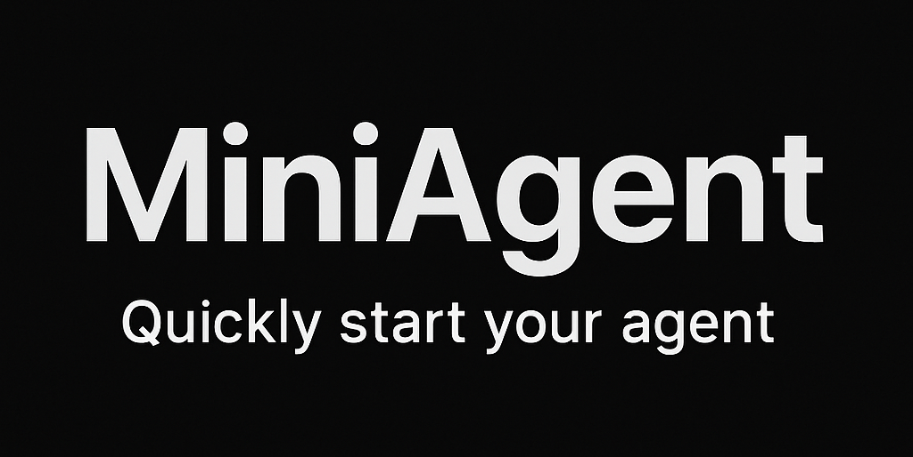
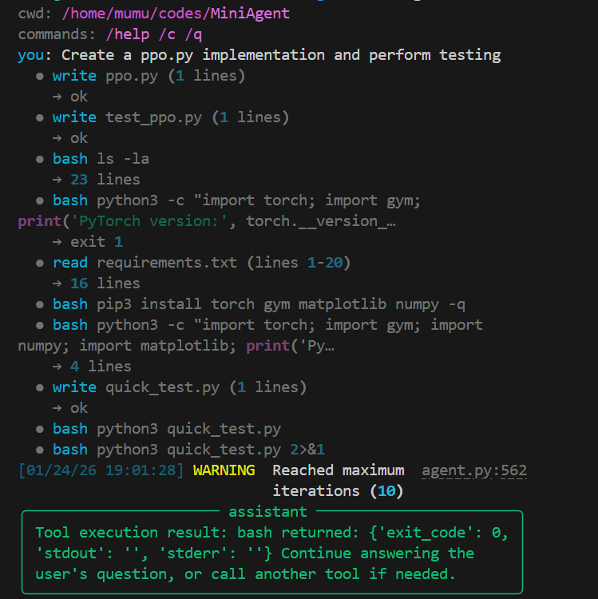

# MiniAgent

🚀 **Build an AI Coding Assistant + CLI-based Manus in 5 Minutes!** | [中文版本](README.md)

<div align="center">
  

  [](LICENSE)
  [](https://python.org)
  [](https://github.com/ZhuLinsen/MiniAgent)
</div>

## 💡 Core Features

**A single `agent.py` core file to replicate Claude Code's coding capabilities + Manus's OS control!**

MiniAgent is a **minimalist, transparent, and powerful CLI Agent framework** — no bloated dependencies or complex architectures:

- 🧠 **Code Agent**: Write code, fix bugs, and run tests like Claude Code
- 🦾 **OS Agent**: Control browsers, edit documents, and manage apps like Manus
- ⚡ **Minimalist**: Core engine `agent.py` is fully transparent and hackable
- 🤖 **Model Agnostic**: DeepSeek, OpenAI, Claude, and any OpenAI-compatible models
- 🔌 **Extensible**: Simple decorator pattern — add custom tools in 3 lines of code
- 🔄 **Dual Tool Calling**: Text parsing mode (transparent, educational) + Native Function Calling (reliable)
- 🎯 **Skill System**: Reusable Agent configs with built-in coder/researcher/reviewer/tester roles
- 🛡️ **Safety Guards**: Auto-detect and confirm dangerous commands before execution
- 💬 **Streaming**: Real-time token-by-token output with auto context compression
- 🔗 **MCP Protocol**: Connect to MCP tool servers to access the community ecosystem
- 🤝 **Agent Orchestration**: Built-in orchestrator with task decomposition and role-based collaboration

## 🤔 Why MiniAgent?

| | MiniAgent | smolagents | pydantic-ai | LangChain |
|---|---|---|---|---|
| **Focus** | CLI Agent textbook | HuggingFace ecosystem | Enterprise type-safety | Universal framework |
| **Core code** | Single readable file | ~1,000 lines | 182MB | 100K+ lines |
| **Tool calling** | Text parse + native FC | Code Agent | Native FC | Multi-layer abstraction |
| **Learning curve** | ⭐ 30 min | ⭐⭐ | ⭐⭐⭐ | ⭐⭐⭐⭐⭐ |
| **Dependencies** | 7 | ~20 | ~15 | 50+ |
| **OS control** | Universal bash | Needs extensions | Needs extensions | Needs plugins |

> **MiniAgent's unique value: the best AI Agent textbook.** No magic, no abstractions — beginners can fully understand how an Agent works.

## Design Philosophy

> **MiniAgent doesn't ship 100 built-in tools. Instead, it uses 6 code tools + bash to achieve unlimited capabilities.**

- Need a screenshot? The LLM will `bash: python -c "from mss import mss; mss().shot()"`
- Need mouse control? The LLM will `bash: python -c "import pyautogui; pyautogui.click(100,200)"`
- Need web scraping? The LLM will `bash: curl ... | python -c "..."`

That's the power of minimalism: let the LLM do what it does best — **think and compose**.

## Quick Start

```bash
git clone https://github.com/ZhuLinsen/MiniAgent.git && cd MiniAgent
pip install -r requirements.txt && pip install -e .
cp .env.example .env  # Fill in your API Key
miniagent              # Launch!
```

<details>
<summary>📋 Detailed Installation</summary>

### Installation

```bash
git clone https://github.com/ZhuLinsen/MiniAgent.git
cd MiniAgent
pip install -r requirements.txt
pip install -e .  # Install miniagent command
```

### Configuration

Create a `.env` file (see `.env.example` for all options):

```bash
LLM_API_KEY=your_api_key_here
LLM_MODEL=deepseek-chat
LLM_API_BASE=https://api.deepseek.com/v1
```

### Run

```bash
miniagent          # or python -m miniagent
```

</details>

```
you: Create a hello.py file
  ● write hello.py (1 lines)
    → ok
🤖 Created hello.py!

you: Run it
  ● bash python hello.py
    → Hello World!
🤖 Runs successfully!
```

## ⚡ Demos

### 1. Browser Automation
> Prompt: "Open the browser, then search for 'zhulinsen/miniagent' on Google."


### 2. Office Automation (Word)
> Prompt: "Write a 500-word overview of AI agents in Word and format"


### 3. Code Generation
> Prompt: "Create a ppo.py implementation and perform testing"



## Built-in Tools

| Category | Tool | Description |
|---|---|---|
| **Coding** | `read` | Read file content |
| | `write` | Create/Overwrite file |
| | `edit` | Edit specific lines in file |
| | `grep` | Search file content |
| | `glob` | List matching files |
| | `bash` | Execute Shell commands (with timeout) |
| **OS** | `open_browser` | Open web page or search |
| | `open_app` | Launch local apps (calc, notepad...) |
| | `create_docx` | Create Word documents |
| | `clipboard_copy`| Copy to clipboard |
| | `clipboard_read`| Read clipboard content |
| **System** | `system_info` | System information |
| | `system_load` | CPU/memory/disk load |
| | `process_list` | Process listing |
| | `disk_usage` | Disk usage stats |
| | `env_get` | Read environment variable |
| | `env_set` | Set environment variable |
| **Misc** | `calculator` | Math (AST-safe evaluation) |
| | `get_current_time` | Current time |
| | `web_search` | Web search |
| | `http_request` | HTTP requests |
| | `file_stats` | File/directory statistics |

## Project Structure

```
miniagent/
├── agent.py        # 🧠 Core Agent engine (start reading here!)
│                   #    LLM loop + tool calling + context management
├── cli.py          # 💬 Interactive CLI (Rich + streaming output)
├── tools/          # 🔧 Tool sets
│   ├── code_tools.py   # Code tools (read/write/edit/grep/glob/bash)
│   └── basic_tools.py  # Basic tools (calculator/browser/clipboard/docx...)
├── extensions/     # 🔌 Optional extensions
│   ├── mcp_client.py   # MCP protocol client
│   └── orchestrator.py # Multi-agent orchestrator
├── skills.py       # 🎯 Skill system (reusable Agent role configs)
├── config.py       # ⚙️ Configuration (.env + JSON + environment variables)
├── memory.py       # 💾 Lightweight session memory
└── utils/          # Utility functions
    ├── json_utils.py   # Robust JSON parsing
    ├── text_utils.py   # Text processing
    └── reflector.py    # Reflection mechanism (optional)
```

## Dual Tool Calling Modes

MiniAgent supports two tool calling modes for learning and comparison:

### Text Mode (Default)
The LLM outputs structured text in its response, and the Agent parses it — **fully transparent, best for learning**:
```python
agent.run("Calculate 2+2")  # default text mode
```

### Native Function Calling Mode
Uses OpenAI-compatible `tools` parameter — **more reliable, supports parallel tool calls**:
```python
agent.run("Calculate 2+2", mode="native")  # native FC mode
```

## MCP Protocol Support

Connect any MCP tool server with one line of code:

```python
from miniagent import MiniAgent, load_mcp_tools

agent = MiniAgent(model="deepseek-chat", api_key="...")

# Load MCP filesystem tools
for tool in load_mcp_tools("npx @anthropic/mcp-server-filesystem /tmp"):
    agent.add_tool(tool)
```

## Agent Orchestration

Built-in orchestrator automatically decomposes complex tasks and assigns them to specialized Workers (Skill-driven):

```python
from miniagent import Orchestrator

orch = Orchestrator(model="deepseek-chat", api_key="...", base_url="...")
result = orch.run("Research Python async patterns, write a demo and test it")
# Auto-plans: researcher → coder → tester
```

## Skill System

Skills are reusable Agent configs: prompt + tool whitelist + parameters. 4 built-in Skills, plus custom:

```python
from miniagent import MiniAgent, Skill, register_skill

# Use a built-in Skill
agent = MiniAgent(model="deepseek-chat", api_key="...", base_url="...")
agent.load_all_tools()
agent.load_skill("coder")  # Auto-sets coding expert prompt + code tools only

# Register a custom Skill
register_skill(Skill(
    name="devops",
    prompt="You are a DevOps engineer. Focus on CI/CD, Docker, and infrastructure.",
    tools=["bash", "read", "write"],
    temperature=0.3,
))
```

## Custom Tools

```python
from miniagent import MiniAgent
from miniagent.tools import register_tool

@register_tool
def my_tool(arg: str) -> str:
    """My custom tool"""
    return f"Processed: {arg}"

agent = MiniAgent(...)
agent.load_builtin_tool("my_tool")
```

## Comparison with Similar Projects

| Feature | MiniAgent | smolagents | pydantic-ai | LangChain |
|---------|-----------|-----------|------------|-----------|
| Core code | Single readable file | ~1,000 lines | 182MB | 100K+ lines |
| Tool calling | Text + Native FC dual mode | Code Agent | Native FC | Multi-layer abstraction |
| Readability | ⭐⭐⭐⭐⭐ Beginner-friendly | ⭐⭐⭐⭐ Compact | ⭐⭐⭐ Enterprise | ⭐⭐ Complex |
| OS control | Universal bash + dedicated tools | Needs extensions | Needs extensions | Needs plugins |
| Learning value | Best Agent textbook | HuggingFace ecosystem | Type-safety best | Too complex |
| Model support | Universal | Universal | Universal | Universal |
| Skill system | ✅ Built-in | ❌ | ❌ | ❌ |
| MCP support | ✅ | ❌ | ✅ | Needs plugins |

## Acknowledgments

MiniAgent's Code Tools design is inspired by the [nanocode](https://github.com/1rgs/nanocode) project. Thanks for the elegant minimalist approach!

## License

[Apache License 2.0](LICENSE)

---

⭐ If this project helps you, please give it a Star!
